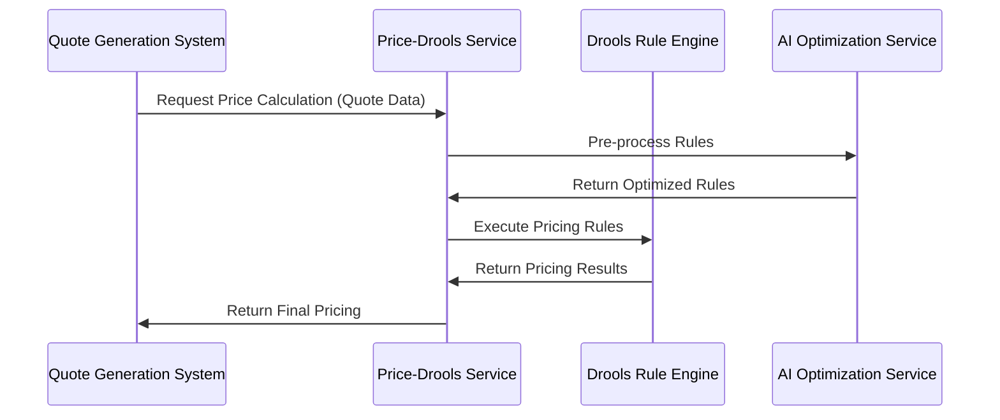

# Price-Drools Service PRD

## Document Control

| Version | Date       | Author | Description of Changes |
|---------|------------|--------|-------------------------|
| 1.0     | 2025-05-15 | AI Team | Initial version |
| 1.1     | 2025-05-15 | AI Team | Added financial metrics rules |
| 1.2     | 2025-05-15 | AI Team | Added AI-powered rule optimization |

## Executive Summary

The Price-Drools Service is a mission-critical microservice designed to centralize and standardize pricing rules for both on-premise and SaaS software products. By integrating with the Drools rule engine, this service enables dynamic, complex pricing strategies without requiring changes to business applications. The service supports sophisticated financial metrics-based pricing including ARR, TCV, ACV, and CLV calculations, while leveraging AI capabilities for continuous rule optimization and improvement.

## Table of Contents

1. [Overview](#1-overview)
2. [Purpose](#2-purpose)
3. [Key Features](#3-key-features)
   - [3.1 Pricing Rule Types](#31-pricing-rule-types)
   - [3.2 Pricing Rule Components](#32-pricing-rule-components)
   - [3.3 Financial Metrics Definitions](#33-financial-metrics-definitions)
   - [3.4 Financial Rule Examples](#34-financial-rule-examples)
   - [3.5 Implementation Considerations](#35-implementation-considerations)
   - [3.6 AI-Powered Rule Optimization](#36-ai-powered-rule-optimization)
4. [Technical Requirements](#4-technical-requirements)
5. [Integration Scenarios](#5-integration-scenarios)
6. [Success Metrics](#6-success-metrics)
7. [Glossary](#7-glossary)

## 1. Overview
The Price-Drools Service is a microservice that integrates with the Drools rule engine to provide dynamic pricing rule evaluation capabilities. This service will serve as a bridge between business applications and the Drools rule engine, enabling centralized management and execution of pricing rules.

## 2. Purpose
The primary purpose of this service is to:
- Provide a standardized interface for pricing rule evaluation
- Abstract the complexity of Drools integration from business applications
- Enable dynamic pricing rule management and deployment
- Support real-time pricing calculations based on configurable business rules
- Facilitate pricing rule creation for both on-premise and SaaS software
- Enable complex pricing scenarios including volume discounts, tiered pricing, and subscription models

## 3. Key Features

### 3.1 Pricing Rule Types

#### 3.1.1 On-Premise Software Pricing Rules
- Volume-based pricing
- Tiered pricing
- Site-based licensing
- Concurrent user licensing
- Perpetual licenses
- Maintenance and support pricing
- Upgrade pricing
- Educational and non-profit discounts
- Volume purchase agreements

#### 3.1.2 SaaS Software Pricing Rules
- Subscription-based pricing
- Usage-based pricing
- User-based pricing
- Feature-based pricing
- Tiered subscription levels
- Annual vs Monthly pricing
- Volume discounts for subscriptions
- Enterprise vs Professional pricing
- Free trial period pricing
- Multi-year commitments

### 3.2 Pricing Rule Components

#### 3.2.1 Rule Actions
- Price calculation
- Discount application
- Tax calculation
- Currency conversion
- Minimum/maximum price enforcement
- Price rounding
- Custom formula calculations
- Price guidance
- Price floor enforcement

#### 3.2.4 Financial Metrics-Based Pricing Rules

```drools
// Rule: Calculate ARR (Annual Recurring Revenue)
rule "Calculate ARR"
    when
        $quote: Quote(
            subscriptionType == "ANNUAL",
            $duration: durationInMonths,
            $monthlyPrice: monthlyPrice
        )
    then
        double arr = $monthlyPrice * 12;
        $quote.setARR(arr);
        logFinancialMetric($quote, "ARR", arr);
end

// Rule: Calculate TCV (Total Contract Value)
rule "Calculate TCV"
    when
        $quote: Quote(
            $duration: durationInMonths,
            $monthlyPrice: monthlyPrice
        )
    then
        double tcv = $monthlyPrice * $duration;
        $quote.setTCV(tcv);
        logFinancialMetric($quote, "TCV", tcv);
end

// Rule: Calculate ACV (Annual Contract Value)
rule "Calculate ACV"
    when
        $quote: Quote(
            $duration: durationInMonths,
            $monthlyPrice: monthlyPrice
        )
    then
        double acv = ($monthlyPrice * $duration) / 12;
        $quote.setACV(acv);
        logFinancialMetric($quote, "ACV", acv);
end

// Rule: Apply Volume Discounts based on ARR
rule "Volume Discount Based on ARR"
    when
        $quote: Quote(
            $arr: ARR,
            $basePrice: basePrice
        )
    then
        double discount = 0.0;
        
        // Apply tiered discounts based on ARR
        if ($arr >= 1000000) discount = 0.25;  // 25% for ARR > $1M
        else if ($arr >= 500000) discount = 0.20;  // 20% for ARR > $500K
        else if ($arr >= 250000) discount = 0.15;  // 15% for ARR > $250K
        else if ($arr >= 100000) discount = 0.10;  // 10% for ARR > $100K
        
        double finalPrice = $basePrice * (1 - discount);
        $quote.setFinalPrice(finalPrice);
        $quote.setDiscountRate(discount);
        
        logFinancialMetric($quote, "ARR_DISCOUNT", discount);
end

// Rule: Apply TCV-based Pricing Tiers
rule "TCV-based Pricing Tiers"
    when
        $quote: Quote(
            $tcv: TCV,
            $basePrice: basePrice
        )
    then
        double priceMultiplier = 1.0;
        
        // Apply multipliers based on TCV
        if ($tcv >= 5000000) priceMultiplier = 1.20;  // 20% premium for TCV > $5M
        else if ($tcv >= 2000000) priceMultiplier = 1.15;  // 15% premium for TCV > $2M
        else if ($tcv >= 500000) priceMultiplier = 1.10;  // 10% premium for TCV > $500K
        
        double finalPrice = $basePrice * priceMultiplier;
        $quote.setFinalPrice(finalPrice);
        $quote.setPriceMultiplier(priceMultiplier);
        
        logFinancialMetric($quote, "TCV_MULTIPLIER", priceMultiplier);
end

// Rule: Apply ACV-based Minimum Commitment
rule "ACV-based Minimum Commitment"
    when
        $quote: Quote(
            $acv: ACV,
            $finalPrice: finalPrice
        )
    then
        double minCommitment = 0.0;
        
        // Set minimum commitments based on ACV
        if ($acv < 50000) minCommitment = 50000;  // Minimum $50K ACV
        else if ($acv < 100000) minCommitment = 100000;  // Minimum $100K ACV
        
        if ($finalPrice < minCommitment) {
            $quote.setFinalPrice(minCommitment);
            logFinancialMetric($quote, "MIN_COMMITMENT", minCommitment);
        }
end

// Rule: Calculate Customer Lifetime Value (CLV)
rule "Calculate CLV"
    when
        $quote: Quote(
            $customer: customer,
            $monthlyPrice: monthlyPrice,
            $expectedDuration: expectedDuration
        )
    then
        double clv = $monthlyPrice * $expectedDuration;
        $quote.setCLV(clv);
        logFinancialMetric($quote, "CLV", clv);
end

// Rule: Apply Churn Risk Adjustment
rule "Churn Risk Adjustment"
    when
        $quote: Quote(
            $customer: customer,
            $finalPrice: finalPrice
        )
        $customer: Customer(
            $churnScore: churnScore
        )
    then
        double churnAdjustment = 0.0;
        
        // Apply adjustments based on churn risk
        if ($churnScore > 70) {
            churnAdjustment = -0.05;  // 5% discount for high churn risk
        } else if ($churnScore > 50) {
            churnAdjustment = -0.03;  // 3% discount for medium churn risk
        }
        
        double finalPrice = $finalPrice * (1 + churnAdjustment);
        $quote.setFinalPrice(finalPrice);
        $quote.setChurnAdjustment(churnAdjustment);
        
        logFinancialMetric($quote, "CHURN_ADJUSTMENT", churnAdjustment);
end
```

### 3.3 Financial Metrics Definitions

#### 3.3.1 Key Financial Metrics
1. **ARR (Annual Recurring Revenue)**
   - Definition: Annualized revenue from recurring subscriptions
   - Formula: Monthly Price × 12
   - Usage: Volume discount tiers, pricing thresholds

2. **TCV (Total Contract Value)**
   - Definition: Total value of a contract over its duration
   - Formula: Monthly Price × Duration in Months
   - Usage: Premium pricing tiers, minimum commitments

3. **ACV (Annual Contract Value)**
   - Definition: Annualized value of a contract
   - Formula: (Monthly Price × Duration) / 12
   - Usage: Minimum commitments, pricing thresholds

4. **CLV (Customer Lifetime Value)**
   - Definition: Predicted revenue from a customer over their lifetime
   - Formula: Monthly Price × Expected Duration
   - Usage: Risk-based pricing adjustments

#### 3.3.2 Pricing Strategies

1. **Volume-based Pricing**
   - Tiers based on ARR thresholds
   - Progressive discounts for larger contracts
   - Minimum commitment levels

2. **Value-based Pricing**
   - Premium multipliers for high TCV
   - Risk-adjusted pricing
   - Minimum value guarantees

3. **Risk-based Adjustments**
   - Churn risk scoring
   - Risk-adjusted pricing
   - Customer lifetime value consideration

4. **Commitment Requirements**
   - Minimum ACV requirements
   - Volume commitments
   - Duration-based requirements

### 3.4 Financial Rule Examples

#### 3.4.1 ARR-based Volume Discounts
- $100K ARR: 10% discount
- $250K ARR: 15% discount
- $500K ARR: 20% discount
- $1M+ ARR: 25% discount

#### 3.4.2 TCV-based Premium Pricing
- $500K TCV: 10% premium
- $2M TCV: 15% premium
- $5M+ TCV: 20% premium

#### 3.4.3 ACV-based Minimum Commitments
- Minimum $50K ACV
- Minimum $100K ACV for enterprise
- Volume-based minimums

#### 3.4.4 Churn Risk Adjustments
- High risk (70+): 5% discount
- Medium risk (50-70): 3% discount
- Low risk: No adjustment

### 3.5 Implementation Considerations

1. **Data Requirements**
   - Customer historical data
   - Contract duration
   - Monthly pricing
   - Expected duration
   - Churn risk scores

2. **Performance Considerations**
   - Caching of financial calculations
   - Batch processing for large contracts
   - Asynchronous calculations

3. **Monitoring Requirements**
   - Financial metric tracking
   - Pricing rule effectiveness
   - Revenue impact analysis
   - Churn correlation analysis

4. **Validation Requirements**
   - Financial metric validation
   - Pricing rule correctness
   - Revenue impact verification
   - Churn prediction accuracy

This comprehensive set of financial rules enables sophisticated pricing strategies based on key business metrics, allowing for:
- Volume-based discounting
- Value-based pricing
- Risk-adjusted pricing
- Minimum commitment enforcement
- Revenue optimization
- Customer lifetime value consideration
- Churn risk mitigation

The rules can be extended to include additional financial metrics and pricing strategies as needed

### 3.6 AI-Powered Rule Optimization

#### 3.6.1 Pre-Execution Rule Optimization

The price-drools-service will support pre-execution rule optimization through integration with AI services:

1. **Optimization Pipeline**:
   - Drools rules will be sent to the AI service before execution
   - The AI service will analyze, evaluate, and optimize the rules
   - Optimized rules will be returned to Drools for execution
   - Performance metrics will be tracked for both original and optimized rules

2. **Optimization Categories**:
   - **Performance Optimization**: Improve rule execution speed
   - **Logic Optimization**: Identify and fix logical inconsistencies
   - **Business Alignment**: Ensure rules align with business objectives
   - **Conflict Resolution**: Identify and resolve rule conflicts
   - **Simplification**: Reduce rule complexity while maintaining behavior

3. **Business Benefits**:
   - Continuous improvement of pricing rules
   - Reduced time-to-market for new pricing strategies
   - Higher quality rules with fewer errors
   - Better alignment between business objectives and rule implementation
   - Enhanced pricing optimization across product portfolio

## 5. Integration Scenarios

### 5.1 Quote Generation System Integration



### 5.2 CRM System Integration

The Price-Drools Service will integrate with CRM systems to provide real-time pricing capabilities:

1. **Deal Configuration**: As sales reps configure deals in the CRM:
   - Product selections sent to Price-Drools Service
   - Customer data retrieved from CRM
   - Pricing calculated and returned to CRM

2. **Approval Workflows**: When deals require approval:
   - Price-Drools Service provides price guidance
   - Applied rules and justifications provided
   - Margin analysis for approval decisions

### 5.3 ERP System Integration

The Price-Drools Service will integrate with ERP systems for order processing:

1. **Order Entry**: During order entry process:
   - Order details sent to Price-Drools Service
   - Final pricing calculated based on contract terms
   - Pricing breakdown returned to ERP

2. **Contract Management**: For contract renewals and amendments:
   - Contract terms analyzed by Price-Drools Service
   - Renewal pricing calculated based on current rules
   - Price adjustments proposed based on customer value

## 6. Success Metrics

### 6.1 Business Metrics

| Metric | Target | Measurement Method |
|--------|--------|--------------------|
| Pricing rule creation time | 70% reduction | Compare time to create rules with and without the service |
| Pricing accuracy | 99.9% | Compare calculated prices to expected outcomes |
| Rule reuse | 60% increase | Track rule reuse across product lines |
| Time-to-market for new pricing strategies | 80% reduction | Measure time from strategy approval to implementation |
| Revenue impact | 5% increase | A/B testing of optimized vs. non-optimized rules |
| Discount variance | 30% reduction | Standard deviation of discount percentages |
| Price optimization influence | 15% increase | Conversion rate for AI-optimized pricing |

### 6.2 Technical Metrics

| Metric | Target | Measurement Method |
|--------|--------|--------------------|
| Rule execution time | <100ms per rule | Performance monitoring |
| System availability | 99.99% | Uptime monitoring |
| API response time | <500ms | API performance monitoring |
| Cache hit rate | >90% | Cache metrics |
| Rule optimization impact | 30% performance improvement | Before/after performance comparison |
| Rule conflict detection | >95% accuracy | Validation against known conflicts |
| Test coverage | >90% | Automated testing metrics |

### 6.3 Adoption Metrics

| Metric | Target | Measurement Method |
|--------|--------|--------------------|
| Business user adoption | >80% | User activity tracking |
| Rule authoring frequency | 200% increase | Rule creation tracking |
| Self-service rule creation | 70% of rules | Source tracking of rule creation |
| Integration adoption | 10 systems in year 1 | Count of integrated systems |
| API call volume | 1M+ daily | API usage monitoring |

## 7. Glossary

| Term | Definition |
|------|------------|
| **ARR** | Annual Recurring Revenue - The annualized value of recurring subscription revenue |
| **TCV** | Total Contract Value - The total value of a contract over its entire duration |
| **ACV** | Annual Contract Value - The value of a contract normalized to an annual amount |
| **CLV** | Customer Lifetime Value - The predicted total revenue from a customer over their lifetime |
| **Drools** | An open-source rule engine that implements the RETE algorithm for rule evaluation |
| **KieSession** | The runtime environment in Drools where rules are executed |
| **Rule** | A business policy implemented as a when-then statement in Drools |
| **Fact** | The data object being evaluated by rules in Drools |
| **DRL** | Drools Rule Language - The syntax used to define rules in Drools |
| **Pre-execution Optimization** | The process of analyzing and improving rules before they are loaded into the rule engine |
| **Churn Risk** | The probability that a customer will discontinue their subscription or service |
| **Volume Discount** | A pricing strategy where the unit price decreases as the quantity increases |
| **Tiered Pricing** | A pricing structure where different price points are applied at different volume thresholds |
| **Pricing Rule** | A business policy that determines how prices are calculated for products or services |

```drools
rule "Enterprise Subscription Bundle Pricing"
    when
        $quote: Quote(
            customerType == "ENTERPRISE",
            subscriptionType == "ANNUAL",
            userCount > 500,
            $effectiveDate: effectiveDate
        )
        $bundle: ProductBundle(
            bundleType == "ENTERPRISE",
            $features: features
        )
        $userCount: Integer() from $quote.userCount
        $duration: Integer() from $quote.durationInMonths
    then
        // Calculate base price based on user count
        double basePrice = $userCount * 100.0;
        
        // Apply volume discount
        double volumeDiscount = calculateVolumeDiscount($userCount);
        
        // Apply feature-based surcharges
        double featureSurcharge = calculateFeatureSurcharge($features);
        
        // Apply enterprise-specific pricing adjustments
        double enterpriseAdjustment = calculateEnterpriseAdjustment($quote);
        
        // Calculate final price
        double finalPrice = (basePrice + featureSurcharge) * (1 - volumeDiscount) + enterpriseAdjustment;
        
        // Apply minimum price guarantee
        double minPrice = calculateMinimumPrice($userCount, $duration);
        finalPrice = Math.max(finalPrice, minPrice);
        
        // Set price and metadata
        $quote.setFinalPrice(finalPrice);
        $quote.setPricingMetadata(new PricingMetadata(
            "ENTERPRISE_BUNDLE",
            volumeDiscount,
            featureSurcharge,
            enterpriseAdjustment,
            minPrice
        ));
        
        // Log pricing details
        logPricingDetails($quote);
end

// Helper functions
function double calculateVolumeDiscount(int userCount) {
    if (userCount > 1000) return 0.20;
    if (userCount > 750) return 0.15;
    if (userCount > 500) return 0.10;
    return 0.0;
}

function double calculateFeatureSurcharge(List<String> features) {
    double surcharge = 0.0;
    if (features.contains("AI_ANALYTICS")) surcharge += 50.0;
    if (features.contains("CUSTOM_REPORTING")) surcharge += 30.0;
    if (features.contains("ADVANCED_SECURITY")) surcharge += 75.0;
    return surcharge;
}

function double calculateEnterpriseAdjustment(Quote quote) {
    double adjustment = 0.0;
    if (quote.isMultiRegion()) adjustment += 100.0;
    if (quote.hasCustomSupport()) adjustment += 200.0;
    return adjustment;
}

function double calculateMinimumPrice(int userCount, int duration) {
    return Math.max(10000.0, userCount * 50.0 * (duration / 12.0));
}

function void logPricingDetails(Quote quote) {
    // Implementation for logging pricing details
}
```

This custom pricing rule demonstrates:
1. Complex condition evaluation
2. Multiple pricing factors
3. Volume-based discounts
4. Feature-based pricing
5. Enterprise-specific adjustments
6. Minimum price guarantees
7. Detailed pricing metadata tracking
8. Helper functions for complex calculations
9. Logging capabilities

The rule handles:
- Enterprise-level subscriptions
- Volume-based pricing tiers
- Feature-based surcharges
- Regional considerations
- Support level adjustments
- Minimum price enforcement
- Multi-year commitments
- Custom enterprise requirements

This example can be extended to handle other complex pricing scenarios by:
1. Adding more condition checks
2. Including additional pricing factors
3. Implementing different discount structures
4. Adding custom validation rules
5. Including more detailed audit logging
6. Supporting different pricing models
7. Handling special enterprise requirements
8. Implementing custom pricing formulas

#### 3.2.2 Rule Conditions
- Customer type
- Region
- Product type
- Quantity
- Duration
- Time-based conditions
- Customer segment
- Contract type
- Payment terms
- Custom attributes

#### 3.2.3 Rule Scopes
- Quote level
- Quote line level
- Product level
- Customer level
- Organization level
- Territory level

### 3.3 Pricing Rule Management

#### 3.3.1 Rule Creation
- Rule definition
- Rule validation
- Rule testing
- Rule deployment
- Rule versioning

#### 3.3.2 Rule Execution
- Rule evaluation order
- Rule conflict resolution
- Rule chaining
- Rule caching
- Rule metrics collection

#### 3.3.3 Rule Monitoring
- Rule execution metrics
- Rule performance monitoring
- Rule error tracking
- Rule usage analytics
- Rule optimization suggestions

## 4. Key Features

### 3.1 Rule Management
- RESTful API endpoints for managing pricing rules
- Support for rule deployment and versioning
- Rule validation before deployment
- Audit logging of rule changes

### 3.2 Rule Evaluation
- Real-time pricing rule evaluation
- Support for batch pricing calculations
- Context-based rule execution
- Caching mechanism for frequently used rules

### 3.3 Integration
- REST API for external service communication
- Secure communication with Drools server
- Support for multiple rule sets
- Error handling and retry mechanisms

## 4. Technical Requirements

### 4.1 Architecture
- Spring Boot microservice architecture
- Containerized deployment (Docker)
- RESTful API design with Spring Web MVC
- Event-driven architecture using Spring Cloud Stream
- Cloud-native design with Spring Cloud
- Spring Cloud Config for centralized configuration

### 4.2 Core Spring Components
- Spring Boot 3.x as the foundation
- Spring Web for REST API implementation
- Spring Data JPA for database operations
- Spring Security for authentication and authorization
- Spring Cache for rule caching
- Spring Cloud for microservice infrastructure
- Spring Cloud Config for externalized configuration
- Spring Cloud Sleuth for distributed tracing
- Spring Cloud OpenFeign for service-to-service communication
- Project Lombok for reducing boilerplate code
- Spring AI for AI/ML integration
- Spring AI Model Serving for model deployment
- Spring AI Data for AI data handling
- Spring AI OpenAI for OpenAI integration
- Spring AI LangChain for language model integration
- Spring AI Vector for vector operations

### 4.3 Integration Components
- Spring Integration Core for rule management
- Spring Integration Kafka for event-driven architecture
- Spring Integration HTTP for API integration
- Spring Integration JMS for message-based communication
- Spring Integration File for file-based operations
- Spring Integration AMQP for RabbitMQ integration
- Spring Integration WebSocket for real-time communication
- Spring Cloud Gateway for API routing
- Spring Cloud Circuit Breaker for fault tolerance
- Spring Cloud LoadBalancer for service discovery
- Spring Integration DSL for fluent API configuration
- Spring Integration Test for integration testing
- Spring Integration WebSocket for WebSocket support
- Spring Integration Redis for Redis integration
- Spring Integration MQTT for MQTT protocol support
- Spring Integration FTP for FTP operations

### 4.4 Dependencies
- Drools Rule Engine (8.x)
- Redis for caching
- PostgreSQL for rule storage
- Prometheus and Grafana for monitoring
- ELK Stack for logging
- Keycloak for authentication
- Spring Boot Actuator for monitoring
- Swagger/OpenAPI for API documentation

### 4.5 Performance Requirements
- Response time: < 200ms for single pricing evaluation
- Throughput: Support for 1000+ concurrent requests
- Latency: < 1s for batch processing
- Availability: 99.9% uptime
- Cache hit rate: > 90% for frequently used rules
- Rule compilation time: < 500ms
- Memory usage: < 512MB under normal load

### 4.6 Security Requirements
- JWT-based authentication using Spring Security
- Role-based access control (RBAC)
- HTTPS/TLS for all external communications
- Secret management with Spring Cloud Config Vault
- Rate limiting with Spring Cloud Gateway
- CSRF protection for web endpoints
- CORS configuration for API access
- Security headers implementation
- Audit logging for sensitive operations

### 4.7 Monitoring and Observability
- Prometheus metrics collection
- Grafana dashboards
- ELK Stack for log aggregation
- Spring Boot Actuator endpoints
- Distributed tracing with Spring Cloud Sleuth
- Health checks and liveness probes
- Performance monitoring
- Error tracking and alerting

### 4.8 Development Tools
- Spring Initializr for project setup
- Spring Boot DevTools for development
- Spring Boot Test for testing
- JUnit 5 for unit testing
- Mockito for mocking
- Testcontainers for integration testing
- Maven for build management
- Docker for containerization
- Git for version control
- CI/CD pipeline with GitHub Actions

### 4.9 API Design
- RESTful API following HATEOAS principles
- OpenAPI/Swagger documentation
- API versioning strategy
- Request/response validation
- Error handling and exception mapping
- API rate limiting
- Cross-origin resource sharing (CORS)
- Content negotiation support

### 4.10 Database Requirements
- PostgreSQL for rule storage
- JPA/Hibernate for ORM
- Liquibase for database migrations
- Caching strategy for frequently accessed data
- Audit logging for database operations
- Connection pooling configuration
- Backup and recovery procedures

## 5. API Specifications

### 5.1 Rule Management Endpoints
```http
POST /api/v1/rules - Create new pricing rule set
GET /api/v1/rules/{id} - Retrieve rule set
PUT /api/v1/rules/{id} - Update rule set
DELETE /api/v1/rules/{id} - Delete rule set
```

### 5.2 Rule Evaluation Endpoints
```http
POST /api/v1/evaluate - Evaluate single pricing rule
POST /api/v1/batch - Batch pricing evaluation
```

## 6. Security Requirements
- JWT authentication for API access
- Role-based access control
- Secure communication with Drools server
- Audit logging of all operations
- Rate limiting for API endpoints

## 7. Monitoring and Logging
- Centralized logging
- Performance metrics collection
- Error tracking and alerting
- Business metrics monitoring

## 8. Success Metrics
- 99.9% service availability
- < 1% error rate in rule evaluations
- < 200ms average response time
- Successful deployment of 100+ pricing rules

## 9. Implementation Phases

### Phase 1: Core Implementation
- Basic service setup
- Core rule evaluation functionality
- Basic API endpoints
- Initial integration with Drools

### Phase 2: Advanced Features
- Caching implementation
- Batch processing
- Rule versioning
- Enhanced error handling

### Phase 3: Monitoring and Optimization
- Performance optimization
- Monitoring setup
- Security enhancements
- Documentation completion
